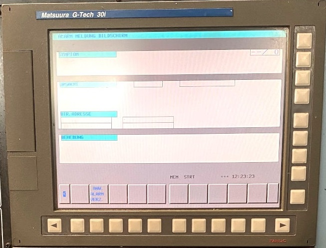
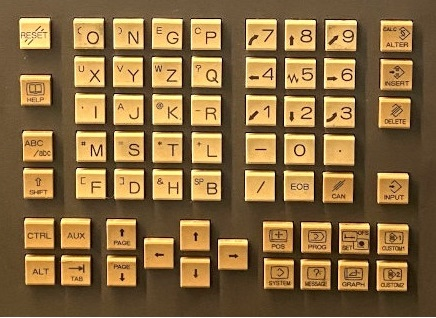

# Matsuura G-Tech 30i

I really wanted to learn React & Tailwind (and Next.js along the way) so I decided to make a recreation of an actual machine panel. There is so much detail and I hope to maybe make it a functional interface for [the gcode parser project I have going](https://github.com/kevinkhill/ncstat) to be able to virtually run programs. 🤯

# Links
When visited [directly to the homepage](https://matsuura-gtech-30i.netlify.app/), the machine will be powered off. You can press (click) any of the display keys (group of 8 on the bottom right of the keyboard) to activate a screen. Screens can also be permalinked via query param as follows:

| Screen | Link |
|--------|------|
Program Page | https://matsuura-gtech-30i.netlify.app?screen=PROGRAM
Position Page | https://matsuura-gtech-30i.netlify.app?screen=POSITION
Offset Page | https://matsuura-gtech-30i.netlify.app?screen=OFFSET
Settings Page | https://matsuura-gtech-30i.netlify.app?screen=SETTINGS
System Page | https://matsuura-gtech-30i.netlify.app?screen=SYSTEM
Messages Page | https://matsuura-gtech-30i.netlify.app?screen=MESSAGES
Graph Page | https://matsuura-gtech-30i.netlify.app?screen=GRAPH
Handyman Page (Custom 1) | https://matsuura-gtech-30i.netlify.app?screen=CUSTOM_1
Webapp Settings (Custom 2) | https://matsuura-gtech-30i.netlify.app?screen=CUSTOM_2

# Reference Images

## Screen

## Keyboard

## Controls

